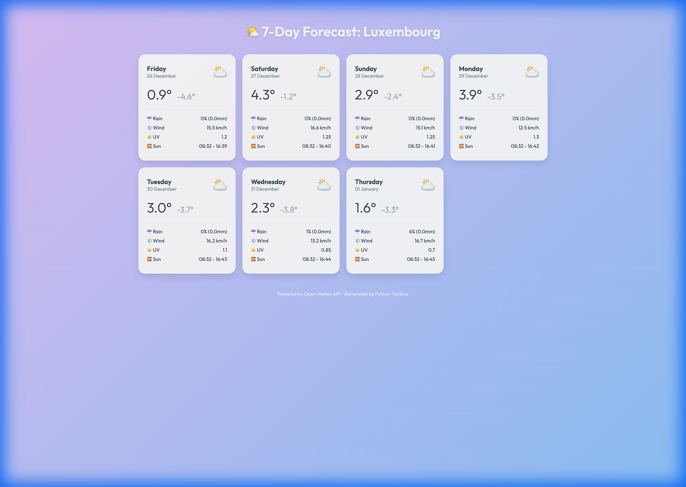

# 🚶 Walkthrough - Lot 4: Weather Forecast (Enhanced) 🌤️

J'ai enrichi le **Lot 4**, transformant l'outil météo en une station complète.

## 📊 Nouveautés (v2)

### 1. Données Étendues
L'outil récupère et affiche désormais :
- 🌬️ **Vent** : Vitesse maximale (km/h).
- ☀️ **UV** : Indice UV maximal.
- 🌅 **Soleil** : Heures de lever et coucher.
- ☔ **Pluie** : Probabilité de précipitation (%) et volume.

### 2. Rapport HTML "Rich UI"
Le rapport HTML a été complètement redessiné ("Card Design") pour afficher ces nouvelles données de manière lisible.



### 3. Console
L'affichage terminal a été élargi pour inclure le Vent et l'UV :
```text
Date         | Wx  | Min/Max   | Rain      | Wind     | UV 
-------------------------------------------------------------------------
Fri 26       | ⛅   | -5/1°     | 0%        | 16km/h   | 1  
```

## 📦 Validation
- **Test** : Lancé avec succès pour "Luxembourg".
- **Dépendances** : Aucune nouvelle librairie (utilise toujours `requests`).
